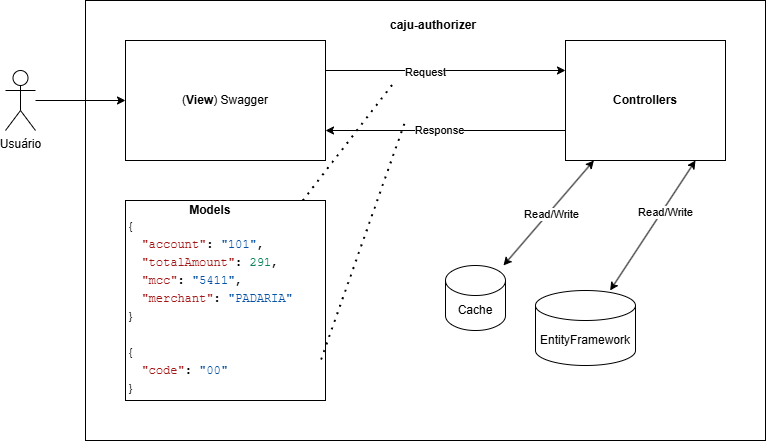
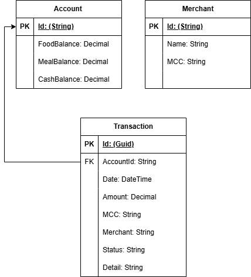

# caju-authorizer

## Sobre

A aplicação caju-authorizer é uma API REST que processa transações onde são verificadas regras de negócio e atualização dos saldos em banco de dados para chegar na conclusão se uma transação é aprovada ou não.

Foi utilizada a linguagem C# com o Framework .NET 8.0 que são tecnologias que a desenvolvedora mais tem contato atualmente.

Este projeto faz parte do processo seletivo da empresa Caju e as especificações estão no neste [link](docs/caju-desafio-especificacoes.pdf).

### Funcionalidades

- **L1. Autorizador Simples**: Usa a MCC (Merchant Category Code) para mapear a categoria de benefícios  (FOOD e MEAL) da transação, usa a categoria CASH caso não reconheça o MCC, por final, aprova ou rejeita a transação baseando-se no saldo.
- **L2. Autorizador com fallback**: Se a MCC não puder ser mapeada para uma categoria de benefícios ou se o saldo da categoria fornecida não for suficiente para pagar a transação inteira, verifica o saldo de CASH e, se for suficiente, debita esse saldo.
- **L3. Dependente do comerciante**: Substitui o MCC com base no nome do comerciante.
- **L4. Transações simultâneas**: Se uma transação for repetida dentro de um minuto (parametrizável), esta transação não é processada.

#### Sobre a L4

Foi chegada a conclusão que o problema poderia ser resolvido com uma idempotência utilizando um cache distribuído, como o Redis. Toda a transação deveria ser armazenada no cache por um determinado momento, e, quando houvesse o reconhecimento de uma transação repetida, ela não seria processada. No projeto, foi implementada a idempotência utilizando um cache em memória.

### Arquitetura

A solução internamente foi dividida em projetos baseando-se no DDD (Domain-Driven Design), contendo a camada de Aplicação, Domínio e Infra, também conta com um projeto de teste.

|Projeto | Descrição|
| --- | --- |
|caju-authorizer-api	|Representa a camada de aplicação que contém a inicialização do programa, a própria API, responsável por se comunicar com o cliente por meio dos endpoints dos controllers|
|caju-authorizer-domain	|Possui toda a regra de negócio|
|caju-authorizer-infra.ioc	|Contém o IoC (Inversion of Control) com a DI (Dependency Injection)|
|caju-authorizer-infra.data	|Contém os repositórios que executam operações nos bancos de dados|
|caju-authorizer-tests	|Projeto de testes unitários e de integração|

A solução também possui a arquitetura MVC (Model-View-Controller), tendo o Swagger como interface de usuário.



### Banco de dados

Foi utilizado o banco de dados em memória Microsoft.EntityFrameworkCore.InMemory, contendo as entidades Account e Merchant.



A aplicação inicializa inserindo alguns registros no banco:

#### Account

| Id | FoodBalance | MealBalance | CashBalance |
| --- | --- | --- | --- |
| 101 | 1000 | 1000 | 1000 |
| 102 | 1000 | 1000 | 1000 |
| 103 | 1000 | 1000 | 1000 |

#### Merchant

| Id | Name | MCC |
| --- | --- | --- |
| 101 | PADARIA DO ZE SAO PAULO BR | 5411 |
| 102 | RESTAURANTE SUSHI SAO PAULO BR | 5412 |
| 103 | SUPERMERCADO GIASSI BLUMENAU SC | 5811 |
| 104 | SUPERMERCADO BISTEK BLUMENAU SC | 5812 |
| 105 | KALUNGA BLUMENAU SC | 1111 |
| 106 | KABUM JOINVILE SC | 1111 |

## Como executar

### Compilação

Na raiz do projeto use comando `dotnet build` para compilar.

### Execução

Na raiz do projeto use  o comando `dotnet run --project` informando o caminho do projeto `caju-authorizer-api.csproj` , por exemplo: `dotnet run --project C:\dev\caju\caju-authorizer\caju-authorizer\caju-authorizer-api.csproj`.

### Swagger

Para visualizar os endpoints pode-se utilizar o Swagger que fica no caminho http://localhost:5035/swagger/index.html

## Endpoints

### Transação

Abaixo está o cURL do endpoint principal para processar a transação.

```bash
curl -X POST 'http://localhost:5035/v1/api/Transactions/Authorize' \
--header 'accept: */*' \
--header 'Content-Type: application/json' \
--data '{
  "account": "101",
  "totalAmount": 291,
  "mcc": "5411",
  "merchant": "PADARIA DO ZE               SAO PAULO BR"
}'
```

#### Respostas

| Status | Conteúdo | Tipo |
| --- | --- | --- |
| 200 OK | {"code": "00"} | Aprovada |
| 200 OK | {"code": "51"} | Rejeitada |
| 200 OK | {"code": "07"} | Erro |

### Contas

Para auxiliar a visualização dos saldos das contas, foi criado dois endpoints para acessar os registros do banco de dados.

#### Visualizar uma conta

É necessário informar o código da conta no final da URL conforme o exemplo abaixo:

```bash
http://localhost:5035/v1/api/Accounts/101
```

#### Visualizar todas as contas

```bash
http://localhost:5035/v1/api/Accounts/
```

## Cobertura de testes

Foi utilizada as bibliotecas NUnit, Moq e AutoFixture para auxiliar nos testes unitários, são ferramentas populares entre desenvolvedores para criar e executar testes automatizados, ajudando a garantir que o código funcione conforme o esperado.

O projeto possui 35 testes e todos foram executados com sucesso, a cobertura está em 100%.

Na raiz do projeto pode-se utilizar o comando `dotnet test` para executar os testes.
